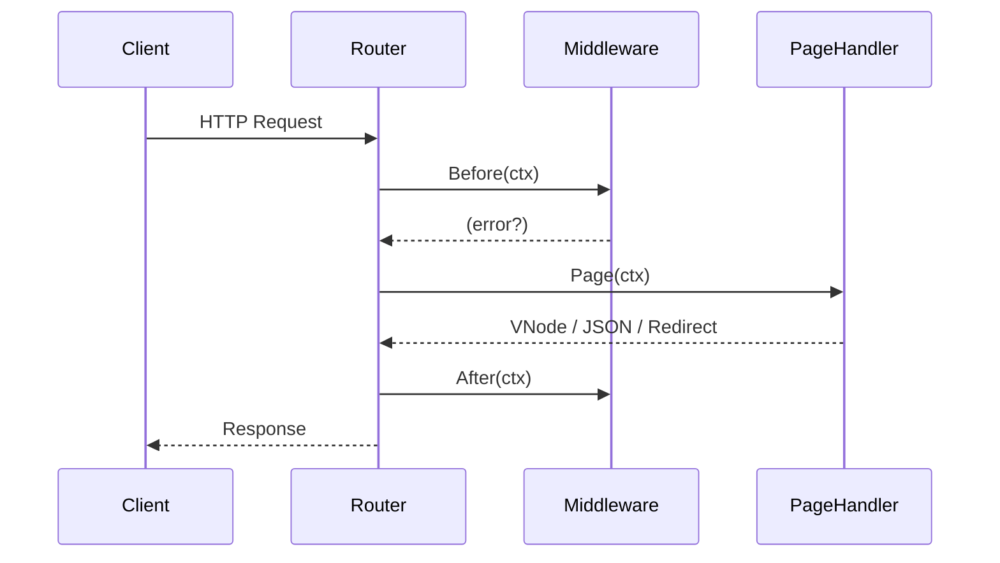

# `vango.Ctx` – Request Context Contract

> **Purpose**: Define the canonical interface passed through routing, middleware, and page handlers so that server, middleware authors, and generated code interoperate safely.

## 1. Interface Definition
```go
// pkg/server/context.go
package server

type Ctx interface {
    // === Request ===
    Request() *http.Request            // raw request pointer (read-only)
    Path() string                      // path without query string
    Method() string                    // GET, POST, etc.
    Query() url.Values                 // parsed query params
    Param(key string) string           // route param, panics if missing

    // === Response ===
    Status(code int)                   // set HTTP status (default 200)
    StatusCode() int                   // current status
    Header() http.Header               // writeable headers
    SetHeader(key, val string)         // convenience
    Redirect(url string, code int)     // sets 30x + Location header
    JSON(code int, v any) error        // serialise & write JSON
    Text(code int, msg string) error   // write text/plain

    // === Session ===
    Session() Session                  // cookie-backed session helpers

    // === Internal === (subject to change)
    Done() <-chan struct{}             // cancellation signal (ctx.Context style)
    Logger() *slog.Logger              // structured logger
}
```
`Ctx` is implemented by `*server.ctxImpl` (unexported) to allow future additions without breaking callers.

### 1.1 `Session` Interface
```go
type Session interface {
    IsAuthenticated() bool
    UserID() string
    Get(key string) (string, bool)
    Set(key, val string)
    Delete(key string)
}
```
Concrete store = signed/encrypted cookie; pluggable with Redis backend.

## 2. Lifecycle & Middleware Flow

`Before` may return `vango.Stop` or error to halt chain. `After` always executes if `Before` succeeded.

## 3. Convenience Helpers
```go
func Stop() error // sentinel used by middleware
```

## 4. Usage Examples
### 4.1 Auth Redirect
```go
func (AuthMW) Before(ctx vango.Ctx) error {
    if !ctx.Session().IsAuthenticated() {
        ctx.Redirect("/login", 302)
        return vango.Stop
    }
    return nil
}
```
### 4.2 JSON API
```go
func Page(ctx vango.Ctx) error {
    users := fetchAll()
    return ctx.JSON(200, users)
}
```

## 5. Thread-safety
`Ctx` is **not** safe for reuse across goroutines; clone via `ctx.Copy()` if needed.

## 6. Changelog
| Date | Version | Notes |
|------|---------|-------|
|2025-08-05|0.1|Initial draft|

## 7. Acceptance & Validation
| Check | Command | Expected |
|-------|---------|----------|
| Lint  | `go vet ./pkg/server/...` | 0 issues |
| Unit Tests | `go test ./pkg/server -run TestCtx` | PASS |
| Session Round-Trip | `go test ./pkg/server -run TestSessionCookie` | Values persist + encrypt |
| JSON Schema | `make schema-validate` | `ctx.schema.json` is valid Draft-07 |

### 7.1 Machine-Readable Schema
The canonical JSON Schema for a serialised `Ctx` (used by the Live Protocol) lives at `internal/schema/ctx.schema.json`.

```jsonc
{
  "$schema": "https://json-schema.org/draft-07/schema#",
  "$id": "https://vango.dev/schema/ctx",
  "type": "object",
  "properties": {
    "path": {"type":"string"},
    "method": {"type":"string"},
    "status": {"type":"integer"},
    "headers": {"type":"object","additionalProperties":{"type":"string"}}
  },
  "required": ["path","method","status"]
}
```

## 8. Cross-References
* Live Protocol message: `@docs/blueprints/live-protocol.md`
* Routing flow: `@docs/blueprints/routing.md`
* Middleware author guide: `@docs/guides/middleware.md`

## 9. Changelog
| Date | Version | Notes |
|------|---------|-------|
|2025-08-05|0.1|Initial draft|
|2025-08-06|0.2|Add validation section and schema link|
