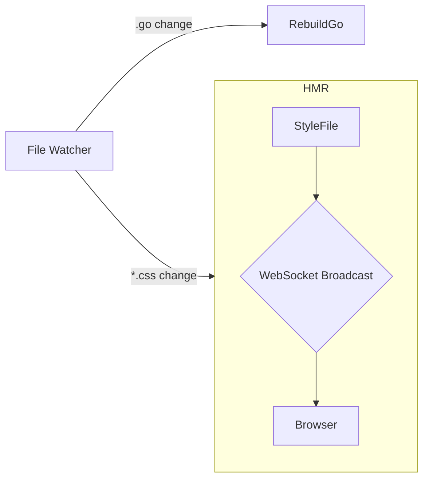

# Styling Blueprint

> **Purpose**: Describe how Vango handles global CSS, Tailwind, and component-scoped styles while maintaining the "Go-only" toolchain ideal.

## 1. Supported Modes
| Mode | Use-case | Build-time | Runtime |
|------|----------|-----------|---------|
| Global CSS | Legacy or design-system stylesheets | Copied + hashed | `<link>` tag HMR |
| Tailwind | Utility-first styling | Run `tailwindcss` binary | Same as global |
| Scoped Style | Component-local CSS blocks | Extract → bundled file | Runtime injects `<link>` once |

## 2. Dev Server Workflow

Browser swaps the `<link>` href to new hash, avoiding full reload.

## 3. Tailwind Integration
* Vendored `tailwindcss` CLI binary in `tools/tailwind/`.  
* `vango dev` spawns it with `--watch` and a JSON content file generated from Go-AST scan of class strings.

## 4. `vango.Style()` API – Runtime & Build Contract
At **runtime before the build rewrite**, `vango.Style()` simply returns a `*vango.ComponentStyle` struct:
```go
// runtime/pkg/styling/component.go
package styling

type ComponentStyle struct {
    Hash  string            // assigned by build step, blank in dev until first compile
    names map[string]string // original → hashed
}

func (c *ComponentStyle) Class(name string) string {
    if v, ok := c.names[name]; ok { return v }
    // Fallback to original name during dev-first-compile to avoid nils
    return name
}
```
The build step replaces the *call expression* with a **literal** containing the hashed names and CSS extraction:
```diff
- card := vango.Style(`.card { ... }`)
+ card := &styling.ComponentStyle{Hash:"_v1a2b", names:map[string]string{"card":"_v1a2b_card","card.dark":"_v1a2b_card_dark"}}
```
A corresponding file `dist/styles/_v1a2b.css` is emitted and linked once.

### 4.1 Usage Example
```go
card := vango.Style(`
  .card { @apply bg-white shadow p-4 rounded }
  .card.dark { @apply bg-gray-800 text-white }
`)

type Props struct{ Dark bool }
func Card(p Props) vango.VNode {
    cls := card.Class("card")
    if p.Dark { cls = card.Class("card.dark") }
    return vango.Div(vango.Class(cls), children...)
}
```

## 5. CSP Handling
Default CSP includes: `style-src 'self' 'sha256-<inline-hash>'`. Nonce option supported for dynamic styles.

## 6. Critical CSS Extraction *(Future)*
Flag `//vango:critical` on style blocks marks them for inlining into `<head>` during SSR for above-the-fold rendering.

## 7. Fonts & Assets
* CSS URLs rewritten to `/assets/<hash>.<ext>` at build.
* `preload` headers injected by SSR for `woff2`.

## 8. Open Questions
* Auto-prefixer: enable by default or plugin?  
* CSS Modules demand?

## 9. Changelog
| Date | Version | Notes |
|------|---------|-------|
|2025-08-05|0.1|Initial draft|
