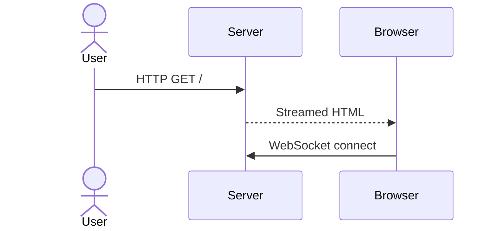

# Vango Documentation Style Guide

This guide ensures that Vango’s docs stay consistent, machine-parsable, and pleasant to read.

## 1. File Headers
Every Markdown file starts with YAML front-matter:

```yaml
---
title: Rendering Pipeline
slug: rendering-pipeline
version: 0.3
phase: P-0          # optional
status: draft       # draft | ratified | deprecated
requires:           # optional adjacency list
  - ADR-0001-single-vdom
---
```

Front-matter is used by:
* Static-site generator to build navigation.
* CI linter to validate broken links & version bumps.
* AI agents to query docs programmatically.

## 2. Heading Levels
```
# H1 – Page title
## H2 – Sections
### H3 – Sub-sections
```
Never skip levels.

## 3. Code Blocks
* Use language identifiers (`go`, `bash`, `mermaid`) for syntax highlighting.
* Keep lines < 100 chars; add ellipsis (`// …`) where content is truncated.

## 4. Diagrams
Use Mermaid where ASCII diagrams would be unclear.



## 5. Commit Messages
Follow Conventional Commits (e.g. `docs(blueprints): add hydration section`).

## 6. Glossary References
First mention of domain term links to `reference/glossary.md`.

## 7. Status Labels
Drafts must be explicitly marked until reviewed. Changing `status:` to `ratified` requires PR approval by at least two maintainers.
